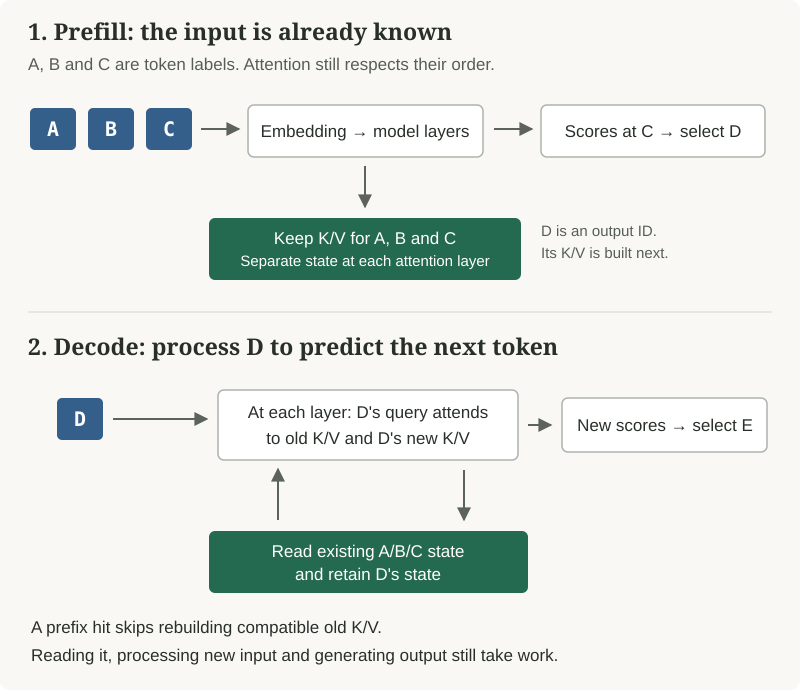
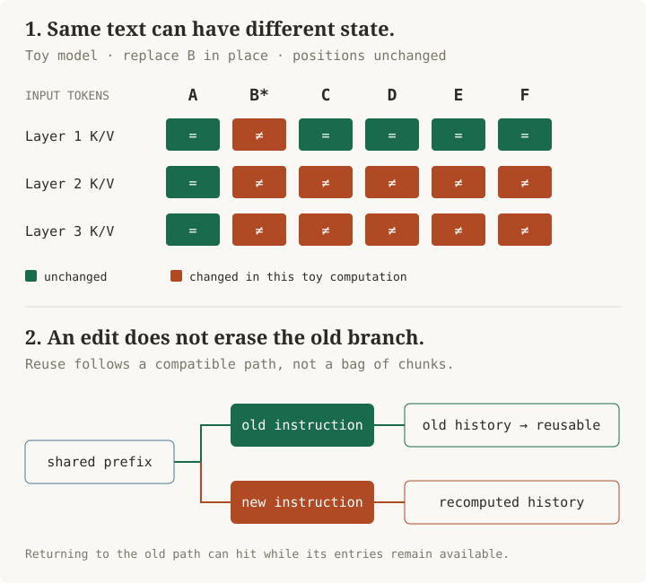

# Can You Change an Agent’s Context Without Losing Its Prompt Cache?

Historical prose draft, September 28–29, 2026. Superseded by [the canonical TypeScript article](../../../packages/blog/posts/prompt-cache-context-edits.ts), which now owns the prose and layout. Kept to preserve the drafting history; later edits belong in the TypeScript post.

I'm building an agent harness, and I want to change its instructions, tools, and retrieved documents without paying to process the whole conversation again. The catch is correctness. A cheap request is no use if the model is still working from an outdated instruction or a document I meant to remove.

My starting picture was a Jenga tower: change something near the bottom of the prompt and everything above it needs rebuilding. That is mostly right for an edit to earlier text. But an agent has other ways to handle change. It can append a new instruction, return to an earlier conversation branch, or deliberately replace a long history with a shorter one.

In a small Sonnet 5.5 test, changing an instruction near the start caused a complete cache miss. Appending the new instruction instead preserved **7,870 cached tokens**. Both requests produced the expected answer. Understanding why those requests differ is the key to building a flexible harness without treating every change as a fresh conversation.

## What the model saves

A prompt first becomes **tokens**: numbers representing pieces of text and the message structure around them. Tokens are often shorter than words. The model turns those numbers into vectors, which are lists of values, then processes them through a stack of layers.

At an attention layer, it creates three kinds of vectors. A **query** is used to decide which earlier positions to attend to. Each earlier position has a **key** used in that comparison and a **value** carrying information to combine into the result. The names are usually shortened to Q, K, and V. These are learned numerical representations, not a database of facts.

When generating the next token, the model needs keys and values for the text already processed. Saving them avoids computing them again. That saved state is the **KV cache**. It exists during ordinary generation even when no provider offers a prompt-caching discount. Reusing compatible state in a later request is the additional step called prompt caching. [Attention mechanism](https://arxiv.org/abs/1706.03762), [walkthrough of the serving code](research/08-kv-cache-walkthrough.md).

There are two stages to keep separate:

- **Prefill:** process the input and create its KV state. A prompt-cache hit can skip much of this work for an unchanged beginning.
- **Decode:** produce new output tokens. With ordinary full attention, each new token still attends over the earlier keys and values. Keeping 100,000 tokens cached does not make them disappear from the next token's computation or from the context window.

<!-- cache:prefill:start -->

<!-- cache:prefill:end -->

That helps explain why a cache hit can be cheap without making the whole response fast. The server may still queue the request, move saved state into GPU memory, process new input, and generate a long answer.

## Why one earlier edit affects later text

A **prefix** is the beginning of the input. A **suffix** is what follows it. For ordinary causal attention, each position can use earlier positions but cannot use future ones. Appending a message therefore leaves the earlier computation valid. Changing an earlier message can change what later positions compute.

Imagine an instruction followed by a document:

```text
Original:  [Report prices in USD.] [A long document about prices…]
Edited:    [Report prices in EUR.] [The same document…]
```

The document's words are unchanged. Its deeper-layer representations need not be: those layers processed the document with the earlier instruction available. Reusing the old document state after replacing USD with EUR can feed the model numbers from a different input than the one requested. Similar meaning, a small text diff, or an unchanged document hash cannot prove the computation is interchangeable.

The serving code tracks this dependency. In vLLM, the identifier for a cached block combines its tokens with the previous block's identifier and other relevant inputs. In simplified pseudocode:

```text
block_id = hash(previous_block_id, token_ids, extra_keys)
```

Changing an early block changes the identifiers of later blocks even when their own tokens stay the same. SGLang organizes cached prefixes as a tree, so requests can share the beginning and branch where they differ. [vLLM block hashing](https://github.com/vllm-project/vllm/blob/28f673957671d8d4c5672c2085b3f22c79c0b0b5/vllm/v1/core/kv_cache_utils.py#L650), [SGLang prefix matching](https://github.com/sgl-project/sglang/blob/2ff52e3ceb0bcfdc8ba1dd0367b39ce0370bbfaf/python/sglang/srt/mem_cache/radix_cache.py#L639).

A new branch does not have to destroy the old one. If I later send the original USD request again, the server may still have its cached state. The limit is availability: entries can expire or be evicted to make room for other work.

<!-- cache:dependencies:start -->

<!-- cache:dependencies:end -->

A [small numerical example](lab/kv_dependency.py) shows the difference. It uses an untrained three-layer transformer and replaces one early token without changing the input length. The table compares its final output scores, called logits, with a fresh calculation:

| Computation | Maximum difference from fresh final logits |
|---|---:|
| Reuse the valid prefix, recompute the rest | 0 |
| Recompute the changed token, splice the old suffix state back in | 0.339935 |
| Append new context to a valid cached prefix | 0 |

Reusing the valid beginning gives the same result. Reattaching the old later state gives a different result. This does not measure answer quality: the tiny model has never learned language. It also shows why “every value after an edit changes” is too strong. At an unchanged later token, the first layer’s keys and values stayed equal; deeper layers changed.

The exact zeros come from running the same arithmetic in the same order. Real serving systems can use different numerical precision or GPU execution orders, so this is not a promise of bit-for-bit identical outputs. [Recorded result and reproduction limits](lab/README.md).

## Follow one request through the four layers

Suppose the user asks an agent to inspect a file. The harness chooses the messages and tools, an SDK turns them into an API request, and the provider runs the model. When the model asks to read the file, the harness executes that tool and sends another request with the result attached.

<!-- cache:layers:start -->
| Layer | What it controls | What to inspect |
|---|---|---|
| Inference engine | State validity, attention, indexing, residency, eviction, execution | Model assumptions, cache identity, matching and scheduling code |
| Provider API | Supported updates, boundaries, lifetime, routing controls, counters, prices | Exact endpoint/model contract and returned usage |
| SDK or adapter | Message conversion, supported options, serialization, response normalization | Final outbound body and raw-to-normalized usage |
| Agent harness | History, prompt versions, tools, retrieved context, compaction, retries | The operation before and after provider conversion |
<!-- cache:layers:end -->

The second request contains the earlier instructions and conversation, followed by the tool call and result. That repeated beginning is a candidate for reuse. The provider still has to recognize an allowed cache boundary and find the saved state. A conversation in the UI is not proof that either happened.

The API's JSON is also not the model's literal input. Providers render roles, tool definitions, images, and messages into their own model input. An SDK can move instructions or transform a tool schema before that rendering happens. To explain a miss, inspect what was actually sent, then compare the returned usage counters.

A conversation ID may tell a provider which history to restore. A named cache object may refer to a fixed saved prefix. A response cache may return a previous answer without running the model. None of these names, on its own, means that arbitrary edited text can reuse old KV state.

## Changing the request in six different ways

The test asked Sonnet 5.5 to return two fields: a currency from the system instruction and a value from record 137. The input contained instructions, reference text, and two blocks of records. Each block ended at an explicit cache boundary: a place where the API was asked to save the preceding input for five minutes. The nine-case sequence ran three times, for 27 requests costing about $0.18. Six of the cases show the useful contrasts:

<!-- cache:measurements:start -->
| Change | Cache reads | New cache writes | Mean estimated whole-request cost |
|---|---:|---:|---:|
| Repeat the original request | 7,870 | 0 | $0.001820 |
| Change the early currency policy | 0 | 7,871 | $0.019934 |
| Return to the original request | 7,870 | 0 | $0.001820 |
| Edit a record in the second block | 5,371 | 2,499 | $0.007568 |
| Append a new system policy | 7,870 | 0 | $0.002486 |
| Append an inline tool definition | 7,870 | 0 | $0.002038 |
<!-- cache:measurements:end -->

Read/write counts were the same in all three repetitions of each case. Every answer matched its expected currency and record value. The early edit and appended instruction both changed the expected currency from USD to EUR; the middle edit changed the expected record value.

Changing record 137 preserved the earlier 5,371-token boundary. The entire second record block was processed again, including its unchanged records before 137. The provider had a saved entry at the block boundary; it did not expose reuse at every unchanged token. “How much text is unchanged?” and “where can this API resume?” can have different answers.

The inline tool request was accepted and kept the prefix hit. It did **not** test whether the model could select or correctly call that tool: the prompt prohibited tool calls. Nor did the test cache the appended control messages for a future turn; all explicit markers were before them.

Cheap also did not mean faster in this sample. The appended-system case had median time to first visible text of **1.761 seconds**, versus **1.432 seconds** for the early edit. Two appended requests generated extra thinking tokens. Timing includes transport, queueing and reasoning; with three ordered samples per case, it would be misleading to claim a general latency result. Appending the update preserved input reuse and cost less here. The two answer fields passed; broader instruction-following behavior was not tested. [Complete method, timing ranges, and counters](research/05-live-anthropic-experiment.md).

For budgeting, separate the stable prefix from everything else. If it contains `P` tokens, appears in `N` requests, and is written once then successfully read on every repeat, its cost is `P × (write price + (N − 1) × read price)`, with prices expressed per token. The uncached comparison is `P × N × ordinary input price`. Add new input, output, and any storage charges separately.

At the tested Sonnet rates, a five-minute write costs 1.25 times ordinary input and a read costs 0.1 times. One successful reuse already pays back the write premium: 1.25 + 0.1 is less than two ordinary prefills. A one-hour write at twice ordinary input would need two successful reuses: 2 + 0.1 is still more than two prefills, but 2 + 0.1 + 0.1 is less than three. These are prefix-only calculations assuming hits inside retention, not measured whole-task savings. Keeping irrelevant text merely to improve hit rate can still cost more than shortening the context. [Dated prices and counter rules](research/05-live-anthropic-experiment.md).

## Add an instruction for the next turn

Anthropic's current API supports system messages within the conversation on selected models, including the tested Sonnet 5.5. A new instruction retains system authority while leaving the preceding prefix intact. Tool additions and removals have their own protocol, including beta inline definitions. This is useful for tools unknown at session start or a schema that changes later. The inline path has constraints, including an initially present non-deferred tool to avoid changing the rendered head when the first new tool appears. [Official update contract](https://platform.claude.com/docs/en/build-with-claude/mid-conversation-system-messages).

The important change is where the new instruction goes. This shortened request shows the shape; the omitted document must be long enough to meet the model's caching threshold:

```json
{
  "system": [{"type": "text", "text": "Report prices in USD."}],
  "messages": [
    {"role": "user", "content": [{
      "type": "text",
      "text": "The original document…",
      "cache_control": {"type": "ephemeral", "ttl": "5m"}
    }]},
    {"role": "system", "content": "From now on, report prices in EUR."}
  ]
}
```

The USD instruction and document remain where they were. The new system message changes the instruction for what follows. This is a supported API operation on the tested model; putting the same words in an ordinary user message would give them a different role.

OpenAI also documents controls for later turns: restrict callable tools while keeping their definitions stable, load deferred tools later, or append supported reasoning-configuration updates. Its current caching behavior differs by model generation; older advice about automatic interval caching and retention keys does not fully describe newer explicit boundaries. [OpenAI cache controls](https://developers.openai.com/api/docs/guides/prompt-caching).

The details differ across APIs:

| Surface | Distinction that changes harness design |
|---|---|
| OpenAI | Some models select boundaries automatically; newer models also let callers mark them explicitly. Supported configuration updates can be appended. |
| Anthropic | Mark blocks yourself or use an automatically advancing boundary. Supported models accept later system and tool updates. |
| Gemini | Automatic reuse and named cache objects are different features. A named object’s stored content cannot be edited. |
| DeepSeek | Matching text is reusable only where the service has stored a suitable prefix unit. |
| OpenRouter | Routes requests to other providers. Staying with the same provider helps locality but does not prove a cache hit. |

The [dated provider report](research/02-provider-contracts.md) records endpoints, limits, counters, hosted-platform distinctions, and authoritative links. In particular, current Gemini Interactions and GenerateContent expose different caching surfaces. Do not transfer the contract of one endpoint to another because both use the same model family. [Gemini caching](https://ai.google.dev/gemini-api/docs/caching), [explicit resources](https://ai.google.dev/api/caching), [DeepSeek persistence](https://api-docs.deepseek.com/guides/kv_cache/), [OpenRouter routing](https://openrouter.ai/docs/guides/best-practices/prompt-caching).

For my harness, *apply this policy from now on* is often enough. A supported system message can express that without changing earlier messages. Removing earlier information is a separate operation: an appended correction leaves the old text and its saved representations in place.

## Check what the SDK actually sends

An API feature is useful only if the SDK sends the right fields.

The [mocked SDK experiment](lab/sdk-wire.mjs) executed published Vercel provider packages and captured their outgoing requests. OpenAI explicit breakpoints and TTL controls survived. An Anthropic mid-conversation system message and tool-removal reference survived too. Those controls reached the outgoing JSON.

There was a smaller gap: the tested OpenAI provider-options schema accepted `mode` and `ttl`, but had no diagnostics comparison-ID field. Supplying an invented JavaScript option did not forward it. The official OpenAI SDK exposed the underlying field. Adding a property to a JavaScript object does not guarantee that an adapter will forward it. This particular gap affected diagnostics; the tested caching controls worked. [Versioned SDK findings](research/04-openai-sdk-codex.md).

When an adapter cannot express a requested update, the caller needs to know what it did instead. Rebuilding the leading prompt may apply the new instruction but change the cost of every following token. A capture of the outgoing request makes that fallback visible.

## How existing harnesses handle changes

The implementations already contain useful ideas to borrow. They also show why a single `cache: true` option cannot describe every operation.

| Harness | Finding at the audited revision |
|---|---|
| Pi | Preserves native system updates when supported; otherwise collapses them into the leading prompt. Tool redefinitions trigger a separate fallback. |
| Oh My Pi | Implements explicit OpenAI cache anchors, Anthropic tool-control history, stable MCP ordering, and cache-warming policy. |
| Codex CLI | Can pin a context window's request-level reasoning effort and append trusted configuration updates on supported models. |
| OpenCode | Applies provider-specific cache markers through AI SDK, with distinct automatic-caching and runtime paths. |
| Gemini CLI | Appends selected retry nudges rather than rewriting system instructions; authentication routes differ. |
| Claude Code | Official documentation describes stable prefixes, appended updates, cache settings, and compaction; this was not a source audit of its production request builder. |

The [harness audit](research/03-harness-audit.md), [Codex audit](research/04-openai-sdk-codex.md), and [Claude Code documentation](https://code.claude.com/docs/en/prompt-caching) provide the versions and evidence boundaries. Default-branch code is not proof of the behavior of an older installed release.

Pi supplied the clearest local reproduction. Using its actual pinned transcript functions, the same system-section change kept the original prefix when native mid-conversation support was enabled. With that capability disabled or unspecified, it replaced the section in the leading system message. Both representations replayed to the same current system text in Pi's helper, but that does not make them identical model inputs. [Fixture and returned transcripts](lab/pi-transcript-results.json).

A harness can expose that result directly: the update was appended, earlier history was rewritten, or the provider does not support the requested operation. That lets callers choose whether the fallback is acceptable before sending the request.

## Replacing a document can be cheaper than appending a correction

Instructions are only half the problem. An agent also needs to replace evidence: a file changes, a search result is outdated, or a tool returns a newer record. Keeping the old version can preserve cache hits while leaving more work for the model.

A second experiment used an inventory record. Version 1 said 6 items at $17 each, for a total of $102. The model answered from that record. Version 2 then changed the values to 9 items at $23, for a total of $207. The next request either replaced the old source and dropped its answer, or retained both and appended an explicit correction.

| Next request | Cache reads | Cache writes | Full request cost |
|---|---:|---:|---:|
| Replace the source and drop the old answer | 3,510 | 76 | $0.0016640 |
| Keep the old source and answer; append the correction | 3,586 | 290 | $0.0022142 |

The appended correction read 76 more cached tokens but cost about **33% more** in this fixture. A cache boundary immediately before the small source let the replacement keep the long background prefix. Only 76 tokens needed rewriting. Appending instead retained the previous question and answer and added the correction, producing a larger new suffix.

Both layouts returned the correct current price, quantity, total, and source identifier in both repetitions. The instructions explicitly told the model to use the highest source revision and recompute from it. There was no answer failure here, and no test of ambiguous source precedence. A larger document, an earlier edit, or a longer remaining conversation could change the cost comparison. [Requests, results, and all eight calls](research/09-changing-retrieved-evidence.md).

A third branch replaced the source but kept the actual old assistant answer. The model corrected the answer and identified it as stale. That branch was already warm from the earlier replacement, so its cache hit is evidence of returning to a computed branch—not of preserving the old source's state through an edit.

The important design issue is that a source and the work based on it are separate objects. Updating a file does not update an earlier summary, plan, or proposed patch. Removing a source does not remove facts copied into those objects. If the operation really means “do not include this old value in the next request,” the harness has to check those copies too.

## What pruning and compaction actually change

**Truncation** shortens an item before or while it enters the context. **Pruning** removes selected older items. **Compaction** builds a smaller continuation, often from a summary plus recent messages. They can all reduce token count, but they do different things to the next request.

```text
Before:
  instructions → long build log → assistant diagnosis → recent work

After pruning:
  instructions → [old log cleared] → assistant diagnosis → recent work

After summarizing:
  instructions → summary of the earlier work → recent work
```

In both rewritten histories, the text of “recent work” may be identical. Its preceding context is different, so unchanged recent messages do not make the old later KV state reusable. The earlier stable instructions may still hit.

OpenCode makes the distinction between stored history and active context easy to see. Its pruning pass stamps an old tool result as compacted. Later, the request converter replaces that result with <code>[Old tool result content cleared]</code> and drops its attachments. The original output string remains in the stored record on that path. [Pruning](https://github.com/anomalyco/opencode/blob/7945de208964a49300d7f770d1a71d078db9a4c4/packages/opencode/src/session/compaction.ts#L269), [request conversion](https://github.com/anomalyco/opencode/blob/7945de208964a49300d7f770d1a71d078db9a4c4/packages/opencode/src/session/message-v2.ts#L294).

Oh My Pi also considers how much already-sent conversation follows a pruning candidate. Deleting a small old result can disturb a much larger cached suffix. Its pruning configuration can protect such a result rather than treating every removed token as an immediate saving. When it does change a message, it invalidates local cached token estimates and message conversions too. Provider caching is only one cache that must stay consistent. [OMP pruning and local invalidation](research/07-context-management.md).

The runnable local examples execute Pi's session-context projection and OMP's pruning functions. Pi drops the old source from active context while retaining a supplied summary that contains its conclusion. OMP removes old tool text while retaining an assistant statement based on it. Neither function has erased the information. That is usually the purpose of summarization, but it matters when the original evidence was wrong or must be removed. [Upstream functions and returned messages](lab/context-harness.mjs), [recorded output](lab/context-results.json).

Compaction also has a cost of its own. It may pay for a summary and a new cache write now to reduce later reads. Under illustrative prices of 1.25 units per written token and 0.1 per cached-read token, retaining 100,000 tokens costs 10,000 units each turn. Replacing them with 20,000 tokens costs 25,000 units once, then 2,000 per later turn. Over three turns those input costs are 30,000 versus 29,000 units, before paying to generate the summary. A summary that loses the key error can erase those savings by causing another investigation. [Calculation and code walkthrough](research/07-context-management.md).

## Can the engine repair and reuse later chunks?

There are research systems that assemble separately cached chunks or repair only some of the state after a change. Their tradeoff is how closely the reused calculation matches processing the complete new input.

**Prompt Cache** uses schema-defined modules and positions. Its paper explicitly describes an attention approximation: independent modules omit some dependencies that ordinary concatenated attention would have computed. **CacheBlend** instead reuses chunks and selectively recomputes tokens to reduce deviation from full recomputation. **PIE**, designed for code edits, repairs positional effects while treating suffix reuse as an approximation. [Prompt Cache](https://arxiv.org/html/2311.04934v2), [CacheBlend](https://arxiv.org/html/2405.16444v3), [PIE](https://proceedings.iclr.cc/paper_files/paper/2025/file/9530635032b95cea9585bd800d308300-Paper-Conference.pdf).

A system can answer a test set just as well while producing different token probabilities. That is weaker than preserving the calculation a fresh request would perform. A position correction is not a recomputation of what the token learned from the old context. Moving or compressing a cache also does not establish that its contents remain valid after an edit.

There are architecture-specific exceptions. A deliberately independent attention mask changes which dependencies exist. Pure local attention can bound their reach, while hybrid or recurrent models require different checkpoint reasoning. None supplies a universal hosted-API operation for editing arbitrary old text while retaining the entire suffix unchanged. [Inference report, implementation details, and research limits](research/01-inference-and-cache-repair.md).

Approximate repair may be useful when a workload can measure and accept its errors. The papers do not establish a general way to replace any earlier text while preserving exactly the computation that a fresh request would perform.

## What I would build into a harness

I would make the requested change explicit before choosing how to preserve the cache:

| Requested operation | Candidate implementation | Required correctness check |
|---|---|---|
| Change a preference from this turn onward | Supported authoritative message appended to history | New behavior applies with the intended scope |
| Add or change a tool | Native tool update where supported; otherwise deliberate rebuild | Correct schema/version and executor permissions |
| Replace stale evidence | New version with explicit precedence, or rebuild the relevant context | The answer uses the intended evidence; old content may still influence appended form |
| Erase or redact earlier content | Rebuild without it and its derived context; address provider retention separately | No claim that an appended correction removes prior information |
| Compact a long session | Summarize and begin a new context version | Task-relevant facts survive; lower hit rate may still reduce total cost |

Stable instructions, deterministic tool ordering, versioned context, and unchanged history avoid accidental misses. Supported prospective controls provide flexibility. Meaningful rewrites should remain visible, even when they cost more.

To diagnose a miss, record the model and serving route, the adapter version, the selected cache boundaries, and a sanitized comparison of consecutive requests. Keep the provider's original usage counters alongside any normalized totals: some APIs include cached tokens in total input and others report separate buckets. Diagnostics can help identify changed instructions or tools, but an eligible request can still miss because its saved state is unavailable. [OpenAI diagnostics](https://developers.openai.com/api/docs/guides/prompt-caching/diagnostics), [Anthropic diagnostics](https://platform.claude.com/docs/en/build-with-claude/cache-diagnostics).

For the harness I'm building, the goal is to preserve useful work while making real changes correctly. Appended instructions and old conversation branches can reuse saved work. Replacing evidence or compacting a session may require a new prefix. That cost can be worth paying when it gives the model a shorter, more accurate context.

---

## Glossary

| Term / claim | Primary source | Date |
|---|---|---|
| Causal attention and state dependencies | [Attention Is All You Need](https://arxiv.org/abs/1706.03762) | 2017 |
| Prefix hash provenance | [Pinned vLLM implementation](https://github.com/vllm-project/vllm/blob/28f673957671d8d4c5672c2085b3f22c79c0b0b5/vllm/v1/core/kv_cache_utils.py#L650) | Inspected 2026-09-28 |
| Mid-conversation system/tool changes | [Anthropic contract](https://platform.claude.com/docs/en/build-with-claude/mid-conversation-system-messages) | Checked 2026-09-28 |
| Provider-specific caching controls | [OpenAI](https://developers.openai.com/api/docs/guides/prompt-caching), [Anthropic](https://platform.claude.com/docs/en/build-with-claude/prompt-caching), [Gemini](https://ai.google.dev/gemini-api/docs/caching) | Checked 2026-09-28 |
| Modular and selectively repaired reuse | [Prompt Cache](https://arxiv.org/abs/2311.04934), [CacheBlend](https://arxiv.org/abs/2405.16444) | 2023 / 2024 preprints; versions reviewed in research |
| Source audits, reproduction and measurements | [Research and runnable labs](README.md) | 2026-09-28 local / 2026-09-29 UTC |
