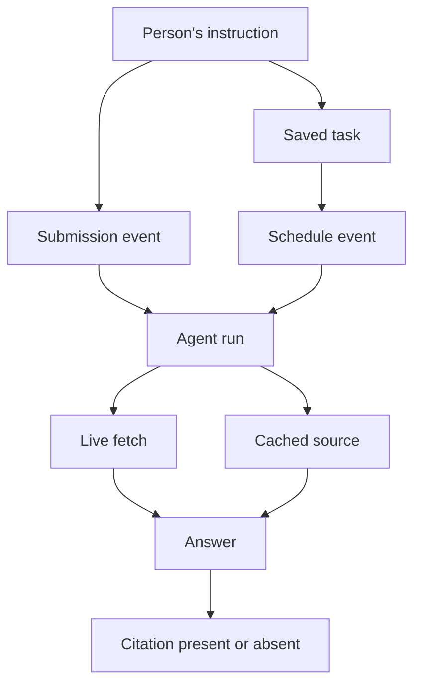

# Who started an agent request, and did the answer cite us?

Research checked September 8, 2026, UTC. Blog baseline: `b338d642f04da6a9c24af513212d4a6565778bc3`. Scope: primary-source research, inspection of the existing verifier, an explicit measurement model, and an experiment proposal. No new model run, production capture, or trigger-classification result is claimed.

**A task's trigger and an answer's citation are separate facts.** They can both be present, either can be absent, and either can remain unknown. Some trigger histories can be established through controlled runs or cooperating systems. A receiving website generally cannot recover that history from a signed HTTP request alone. Citation observation requires the answer or a provider record of it.

The earlier wording compressed these distinctions into a warning without explaining why they matter. The useful question is which part of a person's delegated work reached the site, what happened to the content, and which records support those conclusions.

## The model: responsibility, events, and outcomes

The fact that people designed or authorized a system does not identify what started a particular run. A standing instruction can express a person's goal while a timer starts today's execution. An agent can then select a URL that the person never named. These descriptions can all be true of one task.

Treat the following as separate dimensions. This is our proposed application model, informed by the prior art below; it is not an existing universal classification standard.

| Dimension | Question | Evidence that can establish it |
|---|---|---|
| Goal and authority | Whose task is this, and what authority did they grant? | Retained instruction, task configuration, or a trusted delegation record |
| Run trigger | What event started this execution? | Recorded user submission, scheduler event, webhook, or parent-agent invocation |
| URL selection | Who or what selected this article? | Supplied URL in the input, search/tool record, or followed-link record |
| Request identity | Which key or named service can we attribute the request to? | Verified signature with its key binding and covered components; provider role documentation remains separate |
| Content access | What content reached which component? | Server response, fetch result, extracted passage, or retained model input, with the observation point named |
| Answer attribution | Did the captured answer cite this source, and for which claim? | Complete answer and citation annotations, preserving the provider's field semantics |
| Source support and reliance | Does the source support the claim, and did it affect generation? | Claim/source review for support; a distinct process or intervention study for reliance |
| Reader outcome | Did someone see, use, click, or act on the answer? | Relevant client observation or participant feedback; an answer's existence does not establish attention |

The practical distinction is between the task someone commissioned and the events that executed it. We do not need to identify a stranger personally to record a controlled run's trigger type.

Two hypothetical histories illustrate the difference; neither is a measurement from this site:

| History | Human involvement | Run and content path | Possible result |
|---|---|---|---|
| Immediate request | A person asks an assistant to open a supplied article | A new user submission starts the run; a fetcher requests the page | The answer summarizes it without a citation |
| Standing research task | A person previously requested a weekly report | A timer starts the run; retrieval supplies an indexed copy | The report cites the article without a fresh request reaching our Worker |

Both can serve a person. Only one requires a new user submission, and only one of these examples produces a citation. Request volume therefore cannot stand in for people, citations, or usefulness.

This diagram shows possible recorded paths. It does not imply that every run fetches content, produces an answer, or has an observable human recipient. It also omits retries and delegated subruns; those require parent relationships when they matter to a measurement.

## Prior art that answers the question

### Bot authentication already encounters this ambiguity

Mark Nottingham's [Web Bot Auth use-case draft, Appendix A.4](https://datatracker.ietf.org/doc/html/draft-nottingham-webbotauth-use-cases-02#appendix-A.4), distinguishes bots serving one person, groups, organizations, or several constituencies. It explicitly questions a binary division between bots and humans. This is an individual Internet-Draft dated April 1, 2026, not an adopted IETF conclusion. It gives direct prior art for the user's objection: acting through software does not erase human purpose.

The [September 1 Web Bot Auth protocol draft, sections 3, 4.6, and 7.2](https://datatracker.ietf.org/doc/html/draft-ietf-webbotauth-httpsig-protocol-00), allows the initiating entity to be human or another system. Human authentication, authorization, and delegation fall outside its scope. Its privacy discussion favors automation identities over keys tied to individual people. The draft is work in progress, not an RFC.

The older [RFC 9421, sections 3.2 and 7.3.3](https://www.rfc-editor.org/rfc/rfc9421.html), supplies a further limit: a verifier must establish that a key is appropriate, and the signature covers selected message components. A cryptographic check does not authenticate every unsignaled fact about the workflow.

**Consequence for Radar:** judge Web Bot Auth on the identity claim it makes. Missing human or citation history is an integration boundary, not a defect in a protocol that does not promise it.

### Provenance separates who is responsible from what started the work

[W3C PROV-DM](https://www.w3.org/TR/2013/REC-prov-dm-20130430/), a Recommendation dated April 30, 2013, models entities, activities, and responsible agents. Its `wasStartedBy` relation records an activity's trigger; `actedOnBehalfOf` records delegation; `used` and `wasDerivedFrom` describe data relationships. In this vocabulary an agent can be a person, organization, or software agent.

We can borrow those distinctions without adopting RDF or building a provenance service. Record a task, its start event, and its inputs independently. A person's saved instruction can relate to many later runs. The standard gives a language for claims about history; it does not certify that a recorder told the truth.

[RFC 8693, section 4.1](https://www.rfc-editor.org/rfc/rfc8693.html#section-4.1), provides concrete prior art for delegated authority: the JWT subject and the current actor can differ, with earlier actors retained in nested `act` claims. This establishes a way to convey delegation in an OAuth system. It does not establish a fresh human action for each request, and we have no evidence that public AI fetchers send these tokens to this blog.

[W3C Trace Context](https://www.w3.org/TR/2021/REC-trace-context-1-20211123/) supplies `trace-id` and `parent-id` for joining operations across participating systems. Its security section includes forged trace-ID collisions. A matching trace header is a correlation aid, not human authentication. Its value grows when we control or trust the systems that record and propagate it.

### Provider roles are useful evidence with a defined scope

[OpenAI's crawler documentation](https://developers.openai.com/api/docs/bots) describes ChatGPT-User as serving certain user actions and distinguishes it from automatic crawling. [Anthropic's crawler documentation](https://support.claude.com/en/articles/8896518-does-anthropic-crawl-data-from-the-web-and-how-can-site-owners-block-the-crawler) similarly separates Claude-User from search and training crawlers. Both pages were checked September 8, 2026.

Those descriptions support reporting a documented user-directed client role when identity is sufficiently established. They do not expose the individual submission, URL-selection decision, or answer associated with our observation. A raw User-Agent match is weaker still. Preserve the provider's useful statement without upgrading it to a per-request event trace, or claiming that an unknown trigger disproves human involvement.

### Citation research distinguishes appearance, support, and actual reliance

[Liu, Zhang, and Liang, 2023](https://arxiv.org/abs/2304.09848), audited generative search using citation coverage and whether references support the associated statements. [Gao et al., ALCE, EMNLP 2023](https://aclanthology.org/2023.emnlp-main.398/), developed reproducible evaluation of generated answers and their citations. These supply methods for checking answer evidence. Their historical model results are not estimates for current assistants or this blog.

[Wallat et al., December 2024 preprint](https://arxiv.org/abs/2412.18004), distinguish citation correctness from citation faithfulness: a supporting document need not have caused the model to produce the claim. Their Command-R+ experiments use text insertions to examine post-rationalized citations. The authors state that their empirical scope is limited. The useful lesson is the distinction, not transferring their failure rate to September 2026 systems.

For this project, a captured citation establishes attribution in that output. Reviewing the source tests support. Testing causal reliance requires a separate design; neither a plausible citation nor an assistant's own account of why it cited something settles that question.

[OpenAI's web-search API guide](https://developers.openai.com/api/docs/guides/tools-web-search) makes two practical distinctions available today: the returned source list differs from inline citation annotations, and supported web-search configurations can use cached/indexed results with live access disabled. These are documented API capabilities, not observations of a particular ChatGPT session. They establish why our schema needs separate source and citation fields, and why a citation need not coincide with a new origin fetch.

## What can we determine from each vantage point?

| Evidence available | Defensible conclusion | Remaining unknown |
|---|---|---|
| Worker request and valid signature | The request passed our verifier for the recorded agent identity | Task owner, immediate run trigger, selected URL's origin, downstream citation |
| Authenticated provider identity plus client-role docs | The request belongs to a service documented for that role | The event history of this particular run |
| Controlled prompt or scheduled task plus matched captures | This test run has a recorded trigger and a supported request association | Other users' activity; unobserved provider internals |
| Trusted runtime trace with preserved parent events | The recorded execution and delegation path | Human attention and undisclosed internal work |
| Complete answer with citation annotations | This answer attributes a claim or passage to the URL | Correct support until reviewed; causal reliance until separately tested |
| Claim/source review | Whether the retained source supports the retained claim | Whether that source caused generation or changed a reader's decision |

There is a basic identification limit. A person and a scheduler can invoke the same request helper, which can emit the same signed HTTP message. If the observable message contains no distinguishing trigger record, both histories fit it. A header classifier cannot recover information absent from its inputs. This is a logical counterexample, not a benchmark we executed.

A provider could attach authenticated trigger metadata. That would authenticate the provider's assertion under an agreed contract. Verifying that a person actually performed the asserted action still requires trust in the issuer or additional observations. Do not invent a universal HTTP header for this purpose, or treat an arbitrary `human-triggered: true` field as proof.

The same caution applies to the phrase “the AI read the article.” A server can observe a response; a fetcher can return a passage; a runner can preserve the text it supplied to a model. Name that stage. A fetch or citation alone does not establish complete article access, attention, comprehension, or causal reliance.

## The measurement decision for this blog

Keep recording assisted access as a useful kind of activity. Do not count it as a person, and do not discard it just because a person used an agent. For publishing decisions, a source supporting a useful answer may matter even when nobody clicks through. Establishing that usefulness remains its own observation.

Use separate measures for attributable requests, documented client roles, citations in captured answers, reviewed source support, and attributable reader actions. Report the unit, denominator, window, test exclusions, and missing evidence for each. Unknown trigger is an honest data state; it is not a claim of autonomous intent.

The [existing verifier](https://github.com/gkoreli/blog/blob/b338d642f04da6a9c24af513212d4a6565778bc3/packages/analytics/src/webbotauth.ts) returns `verified` with an agent string, `unverified` with a reason, or `absent`. Inspection of `verifyWebBotAuth` and `verifyCandidate` shows signature parsing, validity checks, key resolution, and cryptographic verification. These functions receive no task transcript or final answer. This is code-inspected evidence of the current interface, not a new conformance test.

For the proposed pilot, extend its saved run records first. No new production table is needed to resolve this terminology.

| Proposed field group | Minimum useful record |
|---|---|
| Task and start | `task_id`, `run_id`, `parent_run_id`, trigger type, event time, evidence reference |
| Selection | Whether the URL was supplied, found through retrieval, followed from another page, or unknown |
| Request | Request/capture ID, signature result, documented role, association method and its limits |
| Content | Returned or supplied content hash, representation, cache evidence, and observation point |
| Answer | Complete output, separate provider source list and citation annotations, capture completeness |
| Review | Claim-support result; citation faithfulness marked untested unless a separate study ran |

These are proposal fields, not shipped columns. Preserve whether each value was observed, stated by the provider, inferred, or unknown, and link it to evidence. Keep task-level identifiers local to the experiment; no end-user identity is needed in the public export.

## A bounded test that could change the article

**Status: proposed and unrun.** Use one owned fixture and one runner with retained input/output records. Compare an immediate submission with a scheduled invocation under a standing instruction. Keep the fetch implementation fixed. Add a cached-content condition to separate generation from new requests. Preserve retries and parent runs instead of counting them as new people.

The first pass can establish whether our records distinguish the trigger conditions and preserve what each output cites. It cannot infer mental intent. Record matched, unmatched, and ambiguous cases. A local mock can test the record format; claims about a named assistant require that assistant's actual execution evidence.

For a public-site probe, retain the chosen path or per-run marker in the explicit capture and verify that redirects or normalization preserve it. A marker that gets reused or exposed elsewhere weakens the association. Never infer a match from timestamps alone, or assume the normal analytics path column preserves a query parameter. Directed probes remain separate from the open-web discovery pilot in [03-experiment-plan.md](03-experiment-plan.md).

A later faithfulness study can vary or withhold supplied source material while holding the task fixed and accounting for repeated-run variation. An unchanged answer does not alone prove non-use: other evidence may support it. Keep this separate from citation-support scoring and from organic discovery; this note does not expand the paid pilot automatically.

The article artifact can show one recorded case at a time: input, trigger evidence, request, content, answer, and citation review. Missing records should remain visible. The current two histories and diagram are conceptual aids; replace them with measured cases only after the experiment runs.

## Claim audit and article use

| Material claim | Evidence state | Inference or limit |
|---|---|---|
| Bot agency need not fit a human/bot binary | Reported: Nottingham's individual draft | Useful framing, not IETF consensus |
| Web Bot Auth does not authenticate a human user or define delegation | Reported: protocol draft inspected | Scope statement; the protocol remains a draft |
| Starts, responsibility, and delegation can be modeled separately | Reported: W3C and IETF standards inspected | Our proposed field design adapts those concepts |
| Client-role documentation differs from an observed trigger | Reported: provider docs inspected | Event-level limit is our inference |
| Citations, source support, and causal reliance differ | Reported: original research inspected | No current-assistant error rate claimed |
| The blog verifier has no task or answer input | Code-inspected | Interface finding, not an executed result |
| The proposed record and test can expose missing links | Proposed | No reproduced behavior claimed |

The [drafted article section](05-article-section-trigger-and-citation.md) is now incorporated into the selected [Promptfoo article](../../oss-radar-07-promptfoo.md). It explains what evaluation traces and saved outputs can establish. Keep Promptfoo central; the standards supply the distinction rather than a second project review. The separate installed synthetic-response test does not execute the trigger comparison proposed here.

The ten-post Measurement boundaries worklist already separates signed-agent identity from citation observation. This research gives those articles a common vocabulary and a testable connection. It does not create a new series or complete either study.
